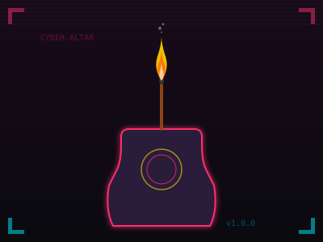

# 赛博上香 (Cyber Incense)

在 Cloudflare 上运行的赛博朋克风格上香祈福 web app。



## 功能

- 🔥 用户注册和登录
- 🕯️ 四种香型：事业、爱情、健康、学业
- 📊 香火排行榜
- 🏆 成就系统
- 🎨 赛博朋克风格界面

## 技术栈

- **Backend**: Cloudflare Workers (TypeScript) + Hono
- **Frontend**: 原生 HTML/CSS/JS
- **Database**: Cloudflare D1 (SQLite)
- **Auth**: JWT (jose)

## 部署

### 1. 安装依赖

```bash
npm install
```

### 2. 创建 D1 数据库

```bash
wrangler d1 create cyber-incense
```

### 3. 更新 wrangler.toml

将输出的 `database_id` 填入 `wrangler.toml`:

```toml
[[d1_databases]]
binding = "DB"
database_name = "cyber-incense"
database_id = "你的-database-id"
```

### 4. 设置 AUTH_SECRET

生成一个随机密钥:

```bash
openssl rand -base64 32
```

将结果填入 `wrangler.toml`:

```toml
[vars]
AUTH_SECRET = "你的密钥"
```

### 5. 本地开发

```bash
npm run dev
```

### 6. 部署

```bash
npm run deploy
```

## 项目结构

```
cyber-incense/
├── src/
│   ├── index.ts      # 入口 & 路由
│   ├── auth.ts       # 认证逻辑
│   ├── incense.ts    # 上香 API
│   ├── db.ts         # 数据库操作
│   └── types.ts      # 类型定义
├── public/
│   ├── index.html    # 首页
│   ├── auth.html     # 登录/注册
│   ├── burn.html     # 上香页
│   ├── me.html       # 个人中心
│   ├── style.css     # 共享样式
│   └── logo.svg      # Logo
├── wrangler.toml
└── package.json
```

## API 端点

| 方法 | 路径 | 说明 |
|------|------|------|
| POST | /api/auth/register | 注册 |
| POST | /api/auth/login | 登录 |
| POST | /api/auth/logout | 登出 |
| GET | /api/auth/me | 获取当前用户 |
| POST | /api/incense | 上香 |
| GET | /api/incense/my | 我的记录 |
| GET | /api/incense/leaderboard | 排行榜 |
| GET | /api/incense/recent | 最新香火 |

## License

MIT